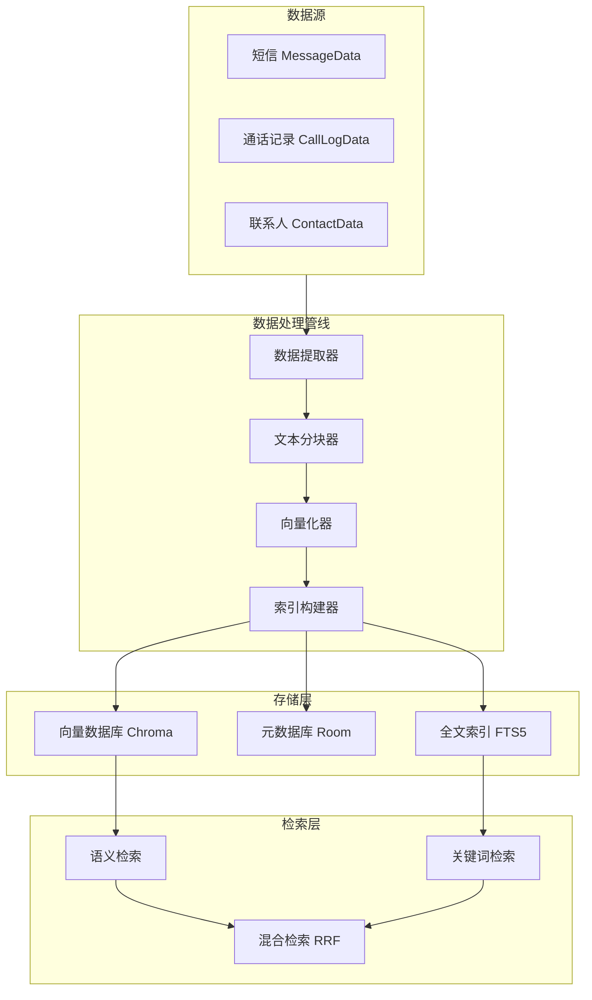
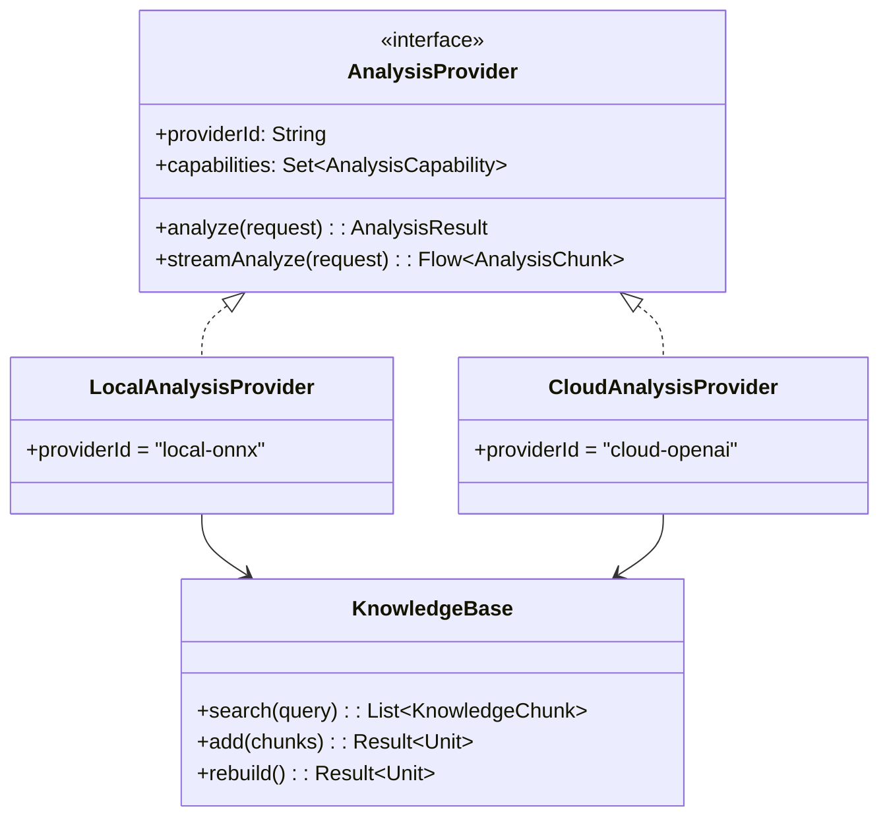
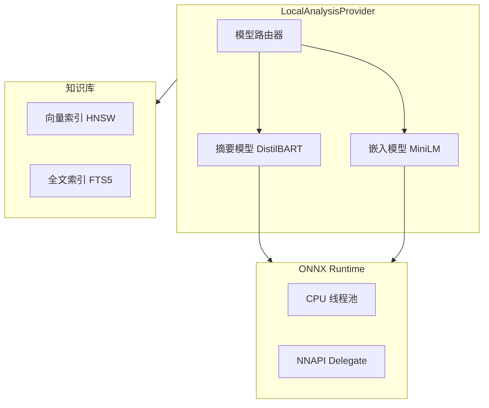
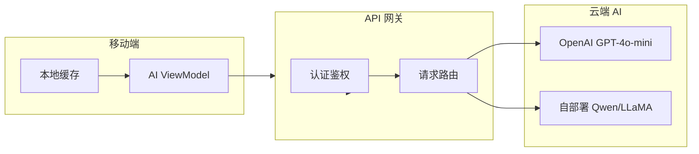
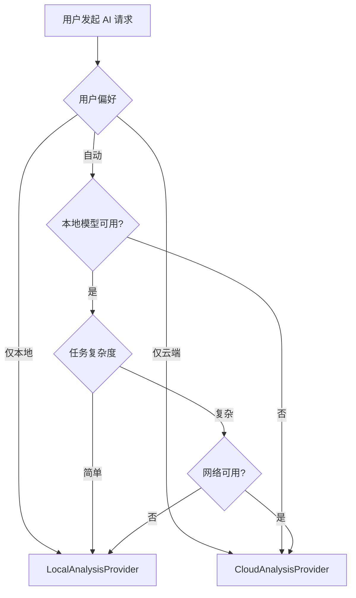
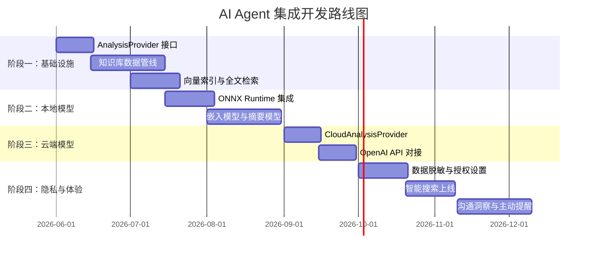

# AI Agent 集成设计文档

## 1. 概述

### 1.1 AI Agent 在消息备份场景中的价值

Commory 积累了用户的短信、通话记录和联系人数据，AI Agent 将改变用户与备份数据的交互方式：

| 价值维度 | 描述 | 示例 |
|---------|------|------|
| 智能检索 | 自然语言查询替代关键词搜索 | "上个月和小王讨论项目进度的消息" |
| 洞察分析 | 自动发现沟通模式和趋势 | "最近三个月联系最频繁的5个人" |
| 内容摘要 | 对大量消息生成精炼摘要 | "上周和客户的沟通要点总结" |
| 主动提醒 | 基于消息内容的智能提醒 | "你答应张三周五前发送文档" |

### 1.2 设计目标

- **隐私优先**：敏感数据默认在本地处理，用户完全掌控数据流向
- **灵活部署**：支持本地模型和云端模型的无缝切换
- **渐进增强**：基础功能不依赖 AI，AI 是增强而非必需
- **可扩展**：支持接入不同 AI 模型和知识库方案

---

## 2. 知识库架构

### 2.1 整体架构



### 2.2 数据分块策略

```kotlin
data class KnowledgeChunk(
    val id: String,
    val sourceType: SourceType,
    val sourceId: String,
    val content: String,
    val metadata: Map<String, String>,
    val embedding: FloatArray? = null
)

enum class SourceType { MESSAGE, CALL_LOG, CONTACT, MESSAGE_THREAD }
```

| 数据类型 | 分块策略 | 说明 |
|---------|---------|------|
| 单条短信 | 保留完整 | 短信通常较短，不需分块 |
| 长短信 | 按段落分块 | 超过 512 字符按段落分割 |
| 消息线程 | 按时间窗口分块 | 同一联系人消息按 24h 窗口聚合 |
| 通话记录 | 聚合分块 | 同一联系人通话按周聚合 |

---

## 3. AI 分析组件接口设计

### 3.1 AnalysisProvider 接口

```kotlin
interface AnalysisProvider {
    val providerId: String
    val displayName: String
    val capabilities: Set<AnalysisCapability>
    val isAvailable: Boolean

    suspend fun analyze(request: AnalysisRequest): AnalysisResult
    suspend fun streamAnalyze(request: AnalysisRequest): Flow<AnalysisChunk>
    fun getSupportedModels(): List<ModelInfo>
}

enum class AnalysisCapability {
    TEXT_SUMMARY, SEMANTIC_SEARCH, PATTERN_ANALYSIS,
    SENTIMENT_ANALYSIS, ENTITY_EXTRACTION,
    CONVERSATION_INSIGHT, TREND_ANALYSIS
}

data class AnalysisRequest(val type: AnalysisType, val query: String, val context: AnalysisContext)
enum class AnalysisType { SUMMARY, SEARCH, PATTERN, INSIGHT, CUSTOM }
data class AnalysisContext(val userId: String, val timeRange: TimeRange? = null, val contactFilter: List<String>? = null)

data class AnalysisResult(val content: String, val sources: List<SourceReference>, val metadata: AnalysisMetadata, val usage: TokenUsage?)
data class SourceReference(val sourceType: SourceType, val sourceId: String, val relevance: Float, val snippet: String)
data class ModelInfo(val id: String, val name: String, val capabilities: Set<AnalysisCapability>, val maxContextLength: Int, val isLocal: Boolean)
```

### 3.2 接口关系图



---

## 4. 本地 AI 模型方案

### 4.1 技术选型

| 方案 | 推理引擎 | 优势 | 劣势 |
|------|---------|------|------|
| ONNX Runtime（推荐） | onnxruntime-android | 生态成熟，模型丰富 | 包体积较大 |
| TensorFlow Lite | tflite | Google 官方支持 | 模型转换复杂 |
| MLC LLM | mlc-llm | 支持手机端 LLM | 硬件要求高 |

### 4.2 本地模型架构



### 4.3 LocalAnalysisProvider 核心逻辑

```kotlin
class LocalAnalysisProvider(
    private val knowledgeBase: KnowledgeBase,
    private val modelManager: LocalModelManager
) : AnalysisProvider {

    override val providerId = "local-onnx"
    override val capabilities = setOf(
        AnalysisCapability.TEXT_SUMMARY,
        AnalysisCapability.SEMANTIC_SEARCH,
        AnalysisCapability.PATTERN_ANALYSIS
    )

    override suspend fun analyze(request: AnalysisRequest): AnalysisResult {
        val startTime = System.currentTimeMillis()
        val chunks = knowledgeBase.search(
            query = request.query, topK = 10,
            timeRange = request.context.timeRange
        )
        val contextText = chunks.joinToString("\n") { "[${it.sourceType}] ${it.content}" }
        val prompt = buildPrompt(request.type, request.query, contextText)
        val result = modelManager.infer(prompt, request.options)
        return AnalysisResult(
            content = result,
            sources = chunks.map { SourceReference(it.sourceType, it.sourceId, it.relevance ?: 0f, it.content.take(200)) },
            metadata = AnalysisMetadata(modelManager.currentModel, providerId, System.currentTimeMillis() - startTime),
            usage = null
        )
    }
}
```

### 4.4 推荐模型

| 用途 | 模型 | 大小 | 说明 |
|------|------|------|------|
| 文本嵌入 | all-MiniLM-L6-v2 | 80MB | 384 维，适合移动端 |
| 文本摘要 | DistilBART-CNN-12-6 | 300MB | 轻量摘要模型 |
| 情感分析 | DistilBERT-SST-2 | 65MB | 二分类情感模型 |

---

## 5. 云端 AI 模型方案

### 5.1 云端模型架构



### 5.2 CloudAnalysisProvider 设计

```kotlin
class CloudAnalysisProvider(
    private val knowledgeBase: KnowledgeBase,
    private val config: CloudAnalysisConfig
) : AnalysisProvider {

    override val providerId = "cloud-${config.providerType}"
    override val capabilities = AnalysisCapability.values().toSet()

    data class CloudAnalysisConfig(
        val providerType: String,
        val apiEndpoint: String,
        val apiKey: String,
        val model: String = "gpt-4o-mini",
        val timeoutMs: Long = 30_000
    )

    override suspend fun analyze(request: AnalysisRequest): AnalysisResult {
        val chunks = knowledgeBase.search(query = request.query, topK = 20)
        val contextText = chunks.joinToString("\n") { "[${it.sourceType}] ${it.content}" }
        val messages = listOf(
            ChatMessage("system", buildSystemPrompt(request.type)),
            ChatMessage("user", "$contextText\n\n${request.query}")
        )
        val response = callCloudAPI(messages, request.options)
        return AnalysisResult(
            content = response.content,
            sources = chunks.map { SourceReference(it.sourceType, it.sourceId, it.relevance ?: 0f, it.content.take(200)) },
            metadata = AnalysisMetadata(config.model, providerId, 0),
            usage = response.usage
        )
    }
}
```

### 5.3 本地/云端切换策略



---

## 6. 隐私保护

### 6.1 隐私保护原则

| 原则 | 说明 | 实施方式 |
|------|------|---------|
| 本地优先 | 敏感数据默认本地处理 | 本地模型为默认选择 |
| 数据脱敏 | 云端传输前脱敏 | 自动替换姓名、号码等 PII |
| 用户可控 | 用户决定数据 AI 可用范围 | 细粒度数据授权设置 |
| 最小必要 | 仅发送分析所需最少数据 | 上下文限制 + 相关性过滤 |

### 6.2 数据脱敏方案

```kotlin
class DataSanitizer {
    private val phonePattern = Regex("""1[3-9]\d{9}""")
    private val emailPattern = Regex("""[\w.-]+@[\w.-]+\.\w+""")

    fun sanitize(text: String): SanitizeResult {
        var sanitized = text
        val replacements = mutableMapOf<String, String>()
        phonePattern.findAll(text).forEach { match ->
            val placeholder = "[PHONE_${replacements.size}]"
            replacements[placeholder] = match.value
            sanitized = sanitized.replace(match.value, placeholder)
        }
        emailPattern.findAll(text).forEach { match ->
            val placeholder = "[EMAIL_${replacements.size}]"
            replacements[placeholder] = match.value
            sanitized = sanitized.replace(match.value, placeholder)
        }
        return SanitizeResult(sanitized, replacements)
    }

    fun restore(text: String, replacements: Map<String, String>): String {
        var restored = text
        replacements.forEach { (k, v) -> restored = restored.replace(k, v) }
        return restored
    }
}
```

### 6.3 用户授权设置

```kotlin
data class AIPrivacySettings(
    val allowLocalAnalysis: Boolean = true,
    val allowCloudAnalysis: Boolean = false,
    val allowMessageAnalysis: Boolean = true,
    val allowCallLogAnalysis: Boolean = true,
    val allowContactAnalysis: Boolean = false,
    val autoSanitize: Boolean = true,
    val excludedContacts: Set<String> = emptySet(),
    val retentionDays: Int = 90
)
```

---

## 7. 开发路线图

### 7.1 阶段规划



### 7.2 里程碑

| 里程碑 | 时间 | 交付物 |
|--------|------|--------|
| M1 - 知识库就绪 | 2026-07 | 数据管线 + 向量索引 + 全文检索 |
| M2 - 本地 AI 可用 | 2026-09 | ONNX 推理 + 嵌入 + 摘要模型 |
| M3 - 云端 AI 可用 | 2026-10 | 云端 API 对接 + 流式输出 |
| M4 - 功能完整 | 2026-12 | 脱敏 + 授权 + 智能搜索 + 洞察 |

### 7.3 风险与应对

| 风险 | 影响 | 应对策略 |
|------|------|---------|
| 本地模型精度不足 | 分析质量不理想 | 云端模型作为降级方案 |
| ONNX 包体积大 | APK 膨胀 | 模型按需下载，不内置 |
| 云端 API 成本 | 运营费用增加 | 本地优先 + 请求缓存 + 限流 |
| 隐私合规风险 | 法律问题 | 严格脱敏 + 用户授权 + 审计 |