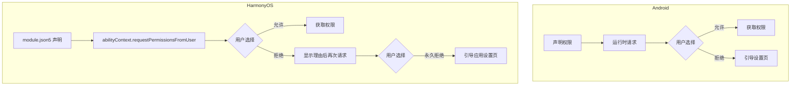
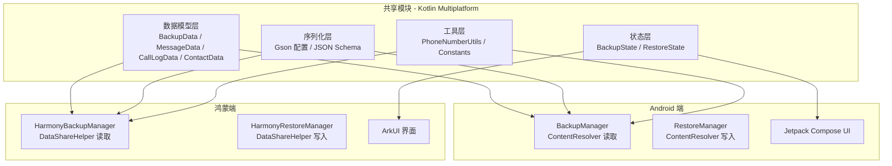
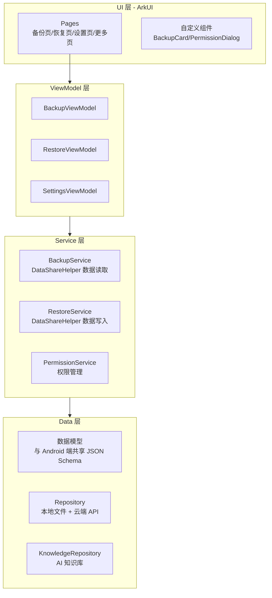
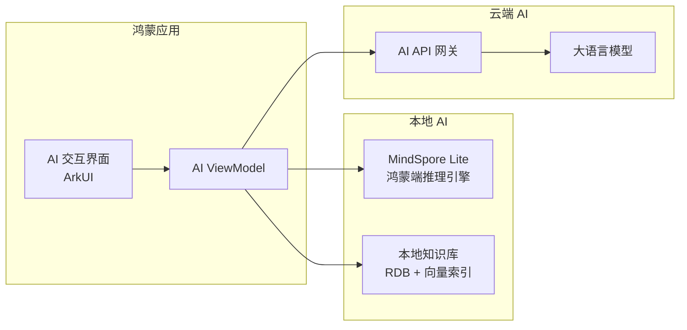
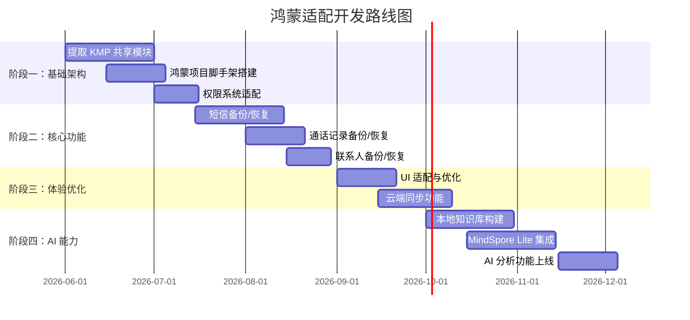

# 鸿蒙适配设计文档

## 1. 概述

### 1.1 背景

随着华为 HarmonyOS 的快速发展和市场份额持续增长，越来越多的用户在鸿蒙系统上使用 Commory。鸿蒙系统从 NEXT 版本开始不再兼容 Android APK，这意味着 Commory 需要开发原生鸿蒙版本以覆盖这部分用户群体。

### 1.2 目标

- 实现与 Android 版本功能对等的鸿蒙原生应用
- 最大化复用现有 Kotlin 核心逻辑，降低开发和维护成本
- 确保鸿蒙端与 Android 端备份数据格式完全兼容
- 为鸿蒙端预留 AI Agent 能力集成接口

### 1.3 范围

本文档覆盖鸿蒙端应用的整体架构设计、权限适配、核心逻辑复用、原生开发方案及 AI Agent 集成规划，不涉及具体代码实现细节。
---

## 2. 鸿蒙权限差异分析

### 2.1 权限模型对比

Android 与 HarmonyOS 在消息类应用的权限模型上存在显著差异：

| 权限功能 | Android | HarmonyOS | 差异说明 |
|---------|---------|-----------|---------|
| 短信读取 | `READ_SMS`（危险权限） | `ohos.permission.READ_MESSAGES`（user_grant） | 鸿蒙需在 module.json5 声明，且用户可随时撤销 |
| 通话记录读取 | `READ_CALL_LOG`（危险权限） | `ohos.permission.READ_CALL_LOG`（user_grant） | 权限名称相似，但授权流程不同 |
| 联系人读取 | `READ_CONTACTS`（危险权限） | `ohos.permission.READ_CONTACTS`（user_grant） | 鸿蒙联系人通过 DataShareHelper 访问 |
| 短信发送 | `SEND_SMS`（危险权限） | `ohos.permission.SEND_MESSAGES`（user_grant） | 鸿蒙需额外申请短信发送能力 |
| 后台运行 | `FOREGROUND_SERVICE` | `ohos.permission.KEEP_BACKGROUND_RUNNING` | 鸿蒙长时任务需明确声明类型 |
| 网络访问 | `INTERNET`（普通权限） | `ohos.permission.INTERNET`（normal） | 基本一致 |

### 2.2 权限申请流程差异



### 2.3 数据访问 API 差异

Android 通过 `ContentResolver` 访问系统数据，而鸿蒙使用 `DataShareHelper`：

| 数据类型 | Android API | HarmonyOS API |
|---------|------------|---------------|
| 短信 | `ContentResolver.query(Telephony.Sms.CONTENT_URI)` | `DataShareHelper.query(SMS_URI)` |
| 通话记录 | `ContentResolver.query(CallLog.Calls.CONTENT_URI)` | `DataShareHelper.query(CALL_LOG_URI)` |
| 联系人 | `ContentResolver.query(ContactsContract.Contacts.CONTENT_URI)` | `DataShareHelper.query(CONTACT_URI)` |

---

## 3. 核心逻辑复用策略

### 3.1 可复用模块识别

当前 Android 项目中，以下模块为纯 Kotlin 逻辑，与 Android 框架无耦合，可直接复用到鸿蒙端：

| 模块 | 路径 | 复用方式 | 说明 |
|------|------|---------|------|
| 数据模型 | `data/models/BackupModels.kt` | Kotlin Multiplatform | `BackupData`、`MessageData`、`CallLogData`、`ContactData` 等纯数据类 |
| 备份状态 | `data/models/BackupModels.kt` | Kotlin Multiplatform | `BackupState`、`RestoreState` 密封类 |
| JSON 序列化配置 | `data/BackupManager.kt` (Gson 配置) | 提取为独立模块 | Gson 实例配置逻辑可跨平台使用 |
| 工具类 | `utils/PhoneNumberUtils.kt` | Kotlin Multiplatform | 号码格式化等纯逻辑 |

### 3.2 Kotlin Multiplatform 复用架构



### 3.3 复用策略实施

**阶段一：提取共享模块**

将纯 Kotlin 数据模型和工具类提取到独立的 Kotlin Multiplatform 模块 `sdk/backup-shared`：

```
sdk/backup-shared/
├── build.gradle.kts          # KMP 构建配置
├── src/
│   ├── commonMain/kotlin/    # 共享代码
│   │   └── imken/commory/shared/
│   │       ├── model/        # 数据模型
│   │       ├── state/        # 状态定义
│   │       └── util/         # 工具类
│   ├── androidMain/kotlin/   # Android 特定实现
│   └── harmonynosMain/kotlin/ # 鸿蒙特定实现
```

**阶段二：定义平台接口**

通过 `expect/actual` 机制处理平台差异：

```kotlin
// commonMain
expect class PlatformDataReader {
    fun readMessages(): List<MessageData>
    fun readCallLogs(): List<CallLogData>
    fun readContacts(): List<ContactData>
}

// androidMain
actual class PlatformDataReader actual constructor() {
    actual fun readMessages(): List<MessageData> {
        // ContentResolver 实现
    }
}

// harmonynosMain
actual class PlatformDataReader actual constructor() {
    actual fun readMessages(): List<MessageData> {
        // DataShareHelper 实现
    }
}
```

---

## 4. 鸿蒙原生开发方案

### 4.1 技术栈选择

| 层次 | 技术方案 | 说明 |
|------|---------|------|
| 开发语言 | ArkTS | 鸿蒙官方推荐语言，TypeScript 超集 |
| UI 框架 | ArkUI (声明式) | 鸿蒙原生 UI 框架 |
| 状态管理 | @State / @Link / AppStorage | ArkUI 内置状态管理 |
| 数据持久化 | 关系型数据库 (RDB) | 鸿蒙本地数据库 |
| 网络请求 | @ohos.net.http | 鸿蒙网络模块 |
| 文件管理 | @ohos.file.fs | 鸿蒙文件系统 |

### 4.2 应用架构



### 4.3 项目结构

```
commory-harmony/
├── entry/
│   └── src/main/
│       ├── ets/
│       │   ├── entryability/
│       │   │   └── EntryAbility.ets
│       │   ├── pages/
│       │   │   ├── BackupPage.ets
│       │   │   ├── RestorePage.ets
│       │   │   ├── PreviewPage.ets
│       │   │   └── SettingsPage.ets
│       │   ├── viewmodel/
│       │   │   ├── BackupViewModel.ets
│       │   │   └── RestoreViewModel.ets
│       │   ├── service/
│       │   │   ├── BackupService.ets
│       │   │   ├── RestoreService.ets
│       │   │   └── PermissionService.ets
│       │   ├── model/
│       │   │   ├── BackupData.ets
│       │   │   ├── MessageData.ets
│       │   │   └── CallLogData.ets
│       │   └── common/
│       │       ├── Constants.ets
│       │       └── Logger.ets
│       └── resources/
│           ├── base/
│           │   ├── element/
│           │   ├── media/
│           │   └── profile/
│           ├── zh_CN/
│           └── en_US/
├── build-profile.json5
└── hvigorfile.ts
```

### 4.4 数据读取实现要点

鸿蒙端通过 `DataShareHelper` 读取系统数据的核心流程：

```typescript
// 短信读取伪代码
import dataShare from '@ohos.data.dataShare';

async function readMessages(context: Context): Promise<MessageData[]> {
    const helper = dataShare.createDataShareHelper(context, SMS_URI);
    const resultColumns = ['_id', 'address', 'body', 'date', 'type', 'read', 'status'];
    const predicate = new dataShare.DataSharePredicates();
    const resultSet = await helper.query(SMS_URI, resultColumns, predicate);

    const messages: MessageData[] = [];
    while (resultSet.goToNextRow()) {
        messages.push({
            id: resultSet.getLong(resultSet.getColumnIndex('_id')),
            address: resultSet.getString(resultSet.getColumnIndex('address')),
            body: resultSet.getString(resultSet.getColumnIndex('body')),
            date: resultSet.getLong(resultSet.getColumnIndex('date')),
            type: resultSet.getLong(resultSet.getColumnIndex('type')),
            read: resultSet.getLong(resultSet.getColumnIndex('read')) === 1,
            status: resultSet.getLong(resultSet.getColumnIndex('status'))
        });
    }
    resultSet.close();
    return messages;
}
```

---

## 5. AI Agent 集成规划

### 5.1 鸿蒙端 AI 能力架构



### 5.2 MindSpore Lite 集成

鸿蒙系统原生支持 MindSpore Lite 作为端侧 AI 推理引擎，相比 Android 端使用 ONNX Runtime / TFLite 更加自然：

| 能力 | Android 方案 | 鸿蒙方案 |
|------|-------------|---------|
| 端侧推理 | ONNX Runtime / TFLite | MindSpore Lite |
| 模型格式 | .onnx / .tflite | .ms (MindSpore) |
| NPU 加速 | NNAPI Delegate | HiAI Delegate |
| API 语言 | Kotlin / Java | ArkTS / C++ |

### 5.3 知识库构建

鸿蒙端知识库基于用户备份数据构建，与 Android 端共享数据格式：

1. **数据索引**：解析备份 JSON 文件，提取消息/通话/联系人数据
2. **向量化存储**：使用 MindSpore Lite 的文本嵌入模型将消息内容向量化
3. **本地检索**：基于向量相似度的语义搜索
4. **隐私保护**：所有向量化计算在本地完成，不上传原始数据

### 5.4 AI 分析场景

| 场景 | 描述 | 实现方式 |
|------|------|---------|
| 消息摘要 | 对大量消息生成摘要 | 本地小模型 / 云端大模型 |
| 联系人洞察 | 分析与某联系人的沟通频率和模式 | 本地统计分析 + AI 解读 |
| 通话分析 | 通话时长/频率趋势分析 | 本地统计 + 可视化 |
| 智能搜索 | 自然语言搜索消息内容 | 向量检索 + 语义匹配 |

---

## 6. 开发路线图

### 6.1 阶段规划



### 6.2 里程碑

| 里程碑 | 时间 | 交付物 |
|--------|------|--------|
| M1 - 架构就绪 | 2026-07 | KMP 共享模块 + 鸿蒙项目骨架 + 权限适配 |
| M2 - 功能对齐 | 2026-09 | 短信/通话/联系人备份恢复完整功能 |
| M3 - 体验完善 | 2026-10 | UI 优化 + 云端同步 + 应用商店上架 |
| M4 - AI 增强 | 2026-12 | 本地知识库 + AI 分析 + 智能搜索 |

### 6.3 风险与应对

| 风险 | 影响 | 应对策略 |
|------|------|---------|
| 鸿蒙 API 变更 | 数据读取接口不稳定 | 封装适配层，隔离 API 变化 |
| KMP 鸿蒙目标支持 | Kotlin 官方对 HarmonyOS 目标支持不完善 | 优先使用 ArkTS 原生实现，KMP 仅共享数据模型 |
| MindSpore 模型生态 | 可用模型较少 | 预留 ONNX 模型转换方案 |
| 鸿蒙应用商店审核 | 审核流程和政策不确定 | 提前了解审核要求，预留调整时间 |

---

## 附录

### A. 术语表

| 术语 | 说明 |
|------|------|
| ArkTS | 鸿蒙应用开发语言，TypeScript 超集 |
| ArkUI | 鸿蒙声明式 UI 框架 |
| DataShareHelper | 鸿蒙数据共享访问助手 |
| MindSpore Lite | 华为端侧 AI 推理框架 |
| KMP | Kotlin Multiplatform |
| module.json5 | 鸿蒙模块配置文件 |

### B. 参考资料

- [HarmonyOS 应用开发文档](https://developer.harmonyos.com/)
- [Kotlin Multiplatform 官方文档](https://kotlinlang.org/docs/multiplatform.html)
- [MindSpore Lite 文档](https://www.mindspore.cn/lite)