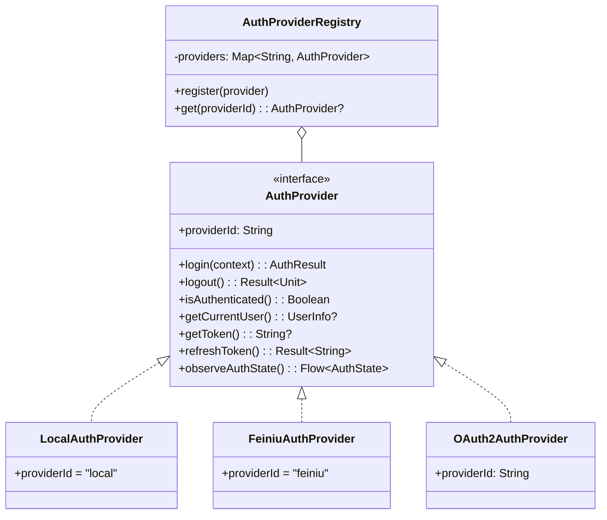
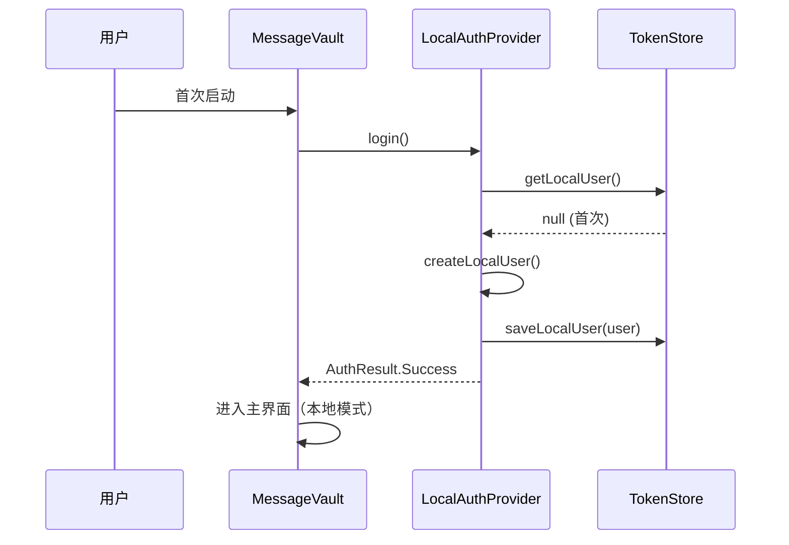
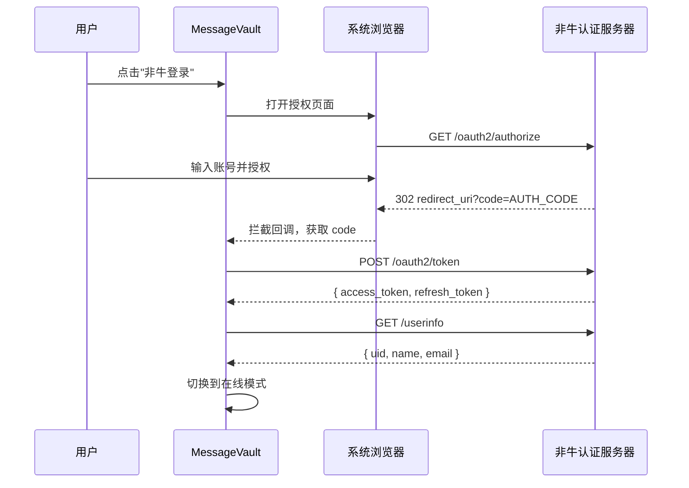
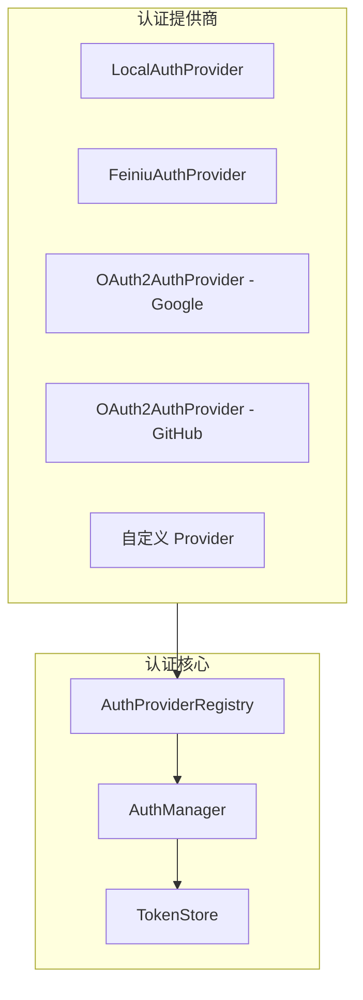
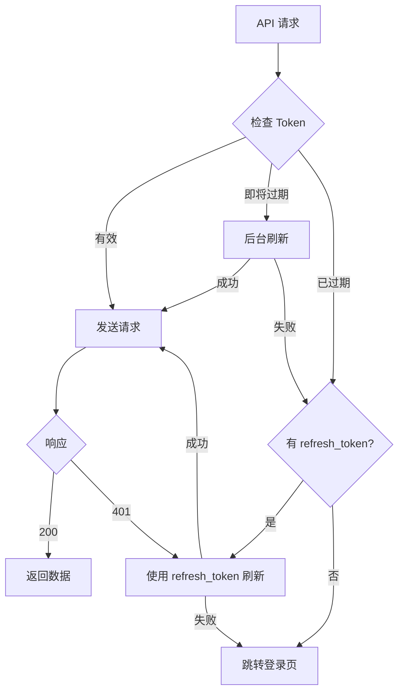

# 第三方登录设计文档

## 1. 概述

### 1.1 背景

MessageVault 当前仅支持本地模式，无需登录即可使用。随着云端同步、AI 分析等功能引入，需要建立统一用户身份体系，支持多种登录方式。

### 1.2 设计目标

- **本地优先**：保持无服务器即可使用的核心能力
- **渐进增强**：登录后解锁云端同步等高级功能
- **可扩展**：灵活接入新的第三方登录提供商
- **安全可靠**：Token 安全存储、自动刷新、HTTPS 强制传输

---

## 2. AuthProvider 接口设计

### 2.1 核心接口

```kotlin
interface AuthProvider {
    val providerId: String
    val displayName: String
    val isAvailable: Boolean

    suspend fun login(context: AuthContext): AuthResult
    suspend fun logout(): Result<Unit>
    fun isAuthenticated(): Boolean
    fun getCurrentUser(): UserInfo?
    suspend fun getToken(): String?
    suspend fun refreshToken(): Result<String>
    fun observeAuthState(): Flow<AuthState>
}
```

### 2.2 数据模型

```kotlin
sealed class AuthState {
    object Unauthenticated : AuthState()
    object Authenticating : AuthState()
    data class Authenticated(val user: UserInfo) : AuthState()
    data class Error(val message: String, val code: String?) : AuthState()
}

data class UserInfo(
    val uid: String,
    val displayName: String,
    val email: String?,
    val avatarUrl: String?,
    val providerId: String,
    val metadata: Map<String, String> = emptyMap()
)

data class AuthToken(
    val accessToken: String,
    val refreshToken: String?,
    val expiresIn: Long,
    val tokenType: String = "Bearer",
    val createdAt: Long = System.currentTimeMillis()
) {
    val isExpired: Boolean
        get() = System.currentTimeMillis() > createdAt + expiresIn * 1000
}

sealed class AuthResult {
    data class Success(val user: UserInfo, val token: AuthToken) : AuthResult()
    data class Failure(val error: AuthError) : AuthResult()
    object Cancelled : AuthResult()
}

sealed class AuthError {
    object NetworkError : AuthError()
    object InvalidCredentials : AuthError()
    object UserCancelled : AuthError()
    data class ProviderError(val code: String, val message: String) : AuthError()
}
```

### 2.3 接口关系图



---

## 3. 本地模式实现

### 3.1 LocalAuthProvider 设计

`LocalAuthProvider` 是默认认证实现，生成本地唯一标识符作为用户 ID，所有数据存储在设备本地。

```kotlin
class LocalAuthProvider(
    private val tokenStore: TokenStore
) : AuthProvider {

    override val providerId = "local"
    override val displayName = "本地模式"
    override val isAvailable = true

    private val _authState = MutableStateFlow<AuthState>(AuthState.Unauthenticated)
    private var localUser: UserInfo? = null

    override suspend fun login(context: AuthContext): AuthResult {
        val user = tokenStore.getLocalUser() ?: createLocalUser()
        localUser = user
        tokenStore.saveLocalUser(user)
        _authState.value = AuthState.Authenticated(user)
        return AuthResult.Success(user, generateLocalToken(user))
    }

    override suspend fun logout(): Result<Unit> {
        localUser = null
        tokenStore.clearLocalUser()
        _authState.value = AuthState.Unauthenticated
        return Result.success(Unit)
    }

    override fun isAuthenticated(): Boolean = localUser != null
    override fun getCurrentUser(): UserInfo? = localUser
    override suspend fun getToken(): String? = tokenStore.getLocalToken()
    override fun observeAuthState(): Flow<AuthState> = _authState

    private fun createLocalUser(): UserInfo = UserInfo(
        uid = "local_${UUID.randomUUID()}",
        displayName = "本地用户",
        email = null, avatarUrl = null, providerId = providerId
    )
}
```

### 3.2 本地模式数据流



### 3.3 本地模式限制

| 功能 | 本地模式 | 在线模式 |
|------|---------|---------|
| 本地备份/恢复 | ✅ | ✅ |
| 云端同步 | ❌ | ✅ |
| 跨设备恢复 | ❌ | ✅ |
| AI 云端分析 | ❌ | ✅ |
| 本地 AI 分析 | ✅ | ✅ |

---

## 4. 非牛登录接入方案

### 4.1 FeiniuAuthProvider 设计

非牛登录采用 OAuth 2.0 授权码模式，用户通过非牛账号认证后获取 Token。

```kotlin
class FeiniuAuthProvider(
    private val config: FeiniuAuthConfig,
    private val tokenStore: TokenStore,
    private val httpClient: HttpClient
) : AuthProvider {

    override val providerId = "feiniu"
    override val displayName = "非牛登录"
    override val isAvailable: Boolean
        get() = config.clientId.isNotEmpty()

    data class FeiniuAuthConfig(
        val clientId: String,
        val clientSecret: String,
        val redirectUri: String,
        val authEndpoint: String = "https://auth.feiniu.com/oauth2/authorize",
        val tokenEndpoint: String = "https://auth.feiniu.com/oauth2/token",
        val userInfoEndpoint: String = "https://api.feiniu.com/userinfo",
        val scopes: List<String> = listOf("openid", "profile", "email")
    )

    override suspend fun login(context: AuthContext): AuthResult {
        _authState.value = AuthState.Authenticating
        return try {
            val authCode = requestAuthCode(context)
            val token = exchangeToken(authCode)
            val user = fetchUserInfo(token.accessToken)
            tokenStore.saveToken(providerId, token)
            tokenStore.saveUser(providerId, user)
            _authState.value = AuthState.Authenticated(user)
            AuthResult.Success(user, token)
        } catch (e: CancellationException) {
            AuthResult.Cancelled
        } catch (e: Exception) {
            AuthResult.Failure(AuthError.ProviderError("FEINIU_ERROR", e.message ?: ""))
        }
    }
}
```

### 4.2 非牛登录流程



---

## 5. OAuth2.0 扩展规划

### 5.1 通用 OAuth2AuthProvider

```kotlin
class OAuth2AuthProvider(
    private val config: OAuth2Config,
    private val tokenStore: TokenStore,
    private val httpClient: HttpClient
) : AuthProvider {

    data class OAuth2Config(
        val providerId: String,
        val displayName: String,
        val clientId: String,
        val clientSecret: String,
        val redirectUri: String,
        val authEndpoint: String,
        val tokenEndpoint: String,
        val userInfoEndpoint: String,
        val scopes: List<String>,
        val userInfoMapper: (Map<String, Any>) -> UserInfo
    )
}
```

### 5.2 扩展点设计



接入新 OAuth2 提供商只需：1) 配置 `OAuth2Config`；2) 实现 `userInfoMapper`；3) 在 Registry 注册。

---

## 6. 安全考量

### 6.1 Token 存储安全

| 存储方式 | 安全等级 | 说明 |
|---------|---------|------|
| EncryptedSharedPreferences | 高 | 基于 Android Keystore 加密（推荐） |
| Android Keystore | 最高 | 硬件级安全，API 复杂 |
| SharedPreferences | 低 | 明文存储，不推荐 |

```kotlin
interface TokenStore {
    fun saveToken(providerId: String, token: AuthToken)
    fun getToken(providerId: String): AuthToken?
    fun clearToken(providerId: String)
    fun saveUser(providerId: String, user: UserInfo)
    fun getUser(providerId: String): UserInfo?
    fun clearUser(providerId: String)
    fun saveLocalUser(user: UserInfo)
    fun getLocalUser(): UserInfo?
    fun clearLocalUser()
    fun saveLocalToken(token: AuthToken)
    fun getLocalToken(): String?
}
```

### 6.2 Token 刷新机制



### 6.3 其他安全措施

| 措施 | 说明 |
|------|------|
| 强制 HTTPS | 所有网络请求必须 HTTPS |
| 证书固定 | 关键 API 启用 Certificate Pinning |
| Token 绑定设备 | Token 与设备指纹绑定 |
| 敏感操作二次验证 | 删除云端数据需重新认证 |
| 本地数据加密 | 备份文件 AES-256 加密 |
| 日志脱敏 | 不记录 Token、密码等敏感信息 |
